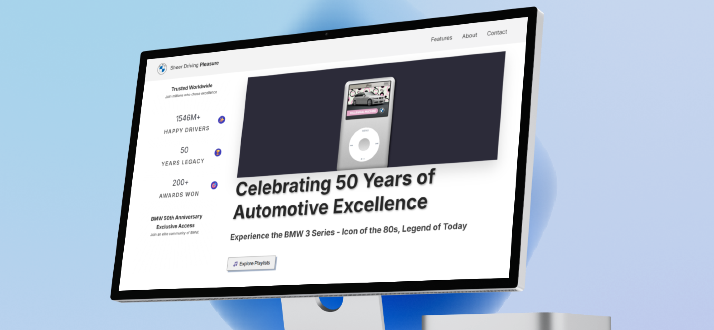
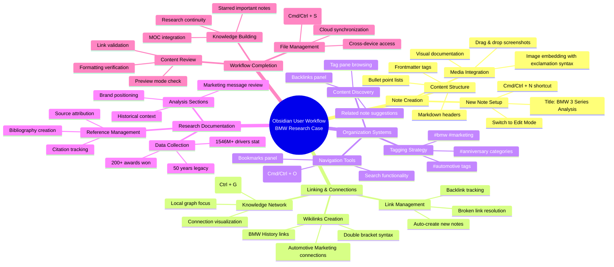

# BMW Case study




## Workflow Technical Diagram/Tree




### Social Proof component

![[Pasted image 20250814194909.png|250]]

```html
<div class="proof-item">

	<div class="pulse-ring"></div>
	<div class="proof-icon">✨</div>
	<span class="proof-number">1546M+</span>
	<span class="proof-text">Happy Drivers</span>

</div>

```

![[bmw-concept-1.excalidraw]]

